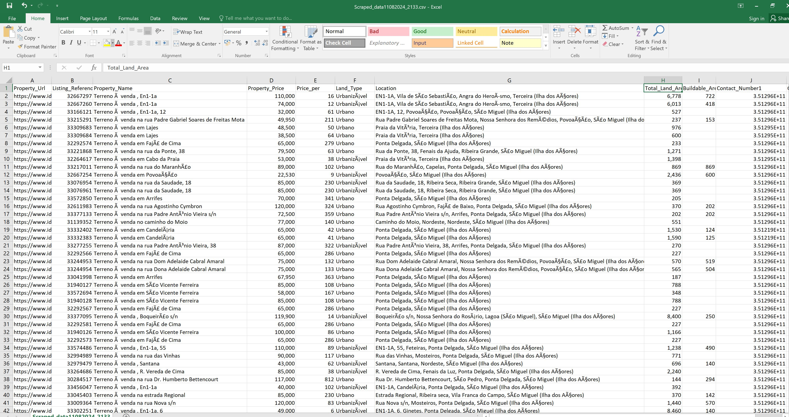

Idealista Scraper
A Python-based web scraper designed for extracting real estate property data from Idealista.pt. This scraper collects key property details such as price, location, land type, and contact information, while handling CAPTCHA challenges via the Scrapfly API.

Features:
Scrapes essential property data including price, location, land type, and contact numbers.
Handles dynamic content and pagination.
Efficient caching for repeated requests.
Stores scraped data in a timestamped CSV file for easy reference.

